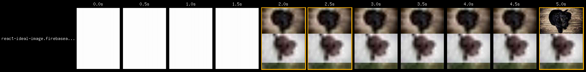
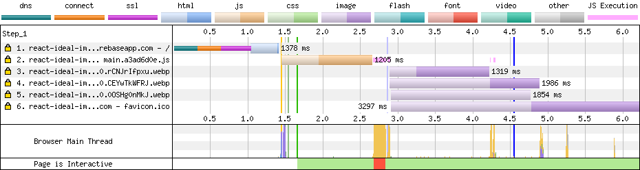
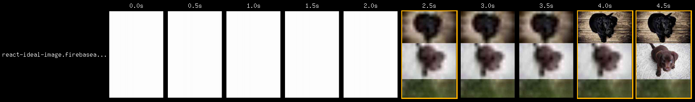
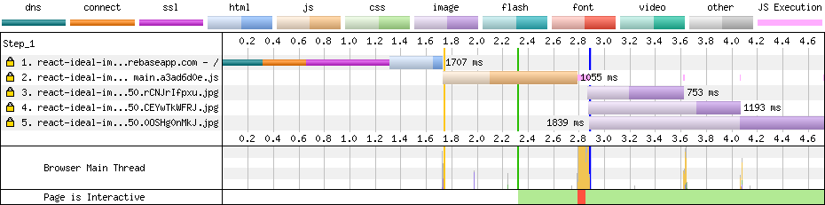
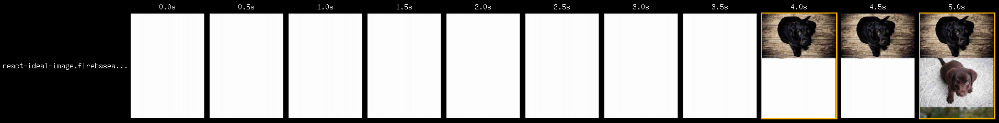
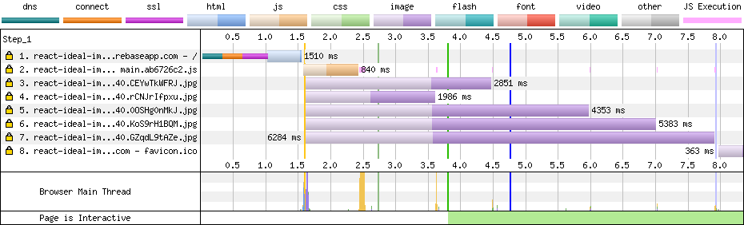
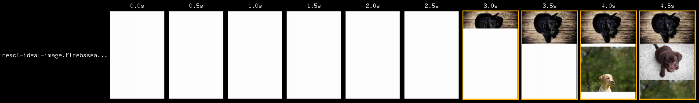
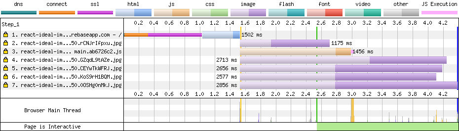

# IdealImage vs img

Measurements are done with the help of webpagetest.org.

## IdealImage

**Source code**: tag [idaelimage-v0](https://github.com/stereobooster/react-ideal-image-experiments/releases/tag/idaelimage-v0)

**File sizes after gzip**:

```
47.51 KB  build/static/js/main.a3ad6d0e.js
109 B     build/static/css/main.65027555.css
```

### Test run Android

Url: https://react-ideal-image.firebaseapp.com/
From: Dulles, VA - Moto G4 - Chrome - 3G

| Load Time | First Byte | Start Render | Speed Index | First Interactive (beta) | Time   | Requests | Bytes In | Time   | Requests | Bytes In | Cost  |
| --------- | ---------- | ------------ | ----------- | ------------------------ | ------ | -------- | -------- | ------ | -------- | -------- | ----- |
| 4.547s    | 1.392s     | 1.657s       | 1859        | > 2.842s                 | 4.547s | 2        | 50 KB    | 5.096s | 6        | 262 KB   | $---- |





### Test run iOS

Url: https://react-ideal-image.firebaseapp.com/
From: Dulles, VA - iPhone 6s iOS 11 - 3G

| Load Time | First Byte | Start Render | Speed Index | First Interactive (beta) | Time   | Requests | Bytes In | Time   | Requests | Bytes In | Cost  |
| --------- | ---------- | ------------ | ----------- | ------------------------ | ------ | -------- | -------- | ------ | -------- | -------- | ----- |
| 3.109s    | 1.485s     | 2.133s       | 2323        | > 3.085s                 | 3.109s | 2        | 51 KB    | 4.759s | 5        | 260 KB   | $---- |





## img

**Source code**: tag [img](https://github.com/stereobooster/react-ideal-image-experiments/releases/tag/img)

**File sizes after gzip**:

```
39.67 KB  build/static/js/main.ab6726c2.js
109 B     build/static/css/main.65027555.css
```

### Test run Android

Url: https://react-ideal-image.firebaseapp.com/
From: Dulles, VA - Moto G4 - Chrome - 3G

| Load Time | First Byte | Start Render | Speed Index | First Interactive (beta) | Time   | Requests | Bytes In | Time   | Requests | Bytes In | Cost  |
| --------- | ---------- | ------------ | ----------- | ------------------------ | ------ | -------- | -------- | ------ | -------- | -------- | ----- |
| 4.756s    | 1.522s     | 3.798s       | 4284        | 2.729s                   | 4.756s | 7        | 1,033 KB | 4.756s | 8        | 1,036 KB | $$$-- |





### Test run iOS

Url: https://react-ideal-image.firebaseapp.com/
From: Dulles, VA - iPhone 6s iOS 11 - 3G

| Load Time | First Byte | Start Render | Speed Index | First Interactive (beta) | Time   | Requests | Bytes In | Time   | Requests | Bytes In | Cost  |
| --------- | ---------- | ------------ | ----------- | ------------------------ | ------ | -------- | -------- | ------ | -------- | -------- | ----- |
| 4.386s    | 1.429s     | 2.533s       | 3564        | > 2.533s                 | 4.386s | 7        | 374 KB   | 4.385s | 7        | 374 KB   | $---- |




